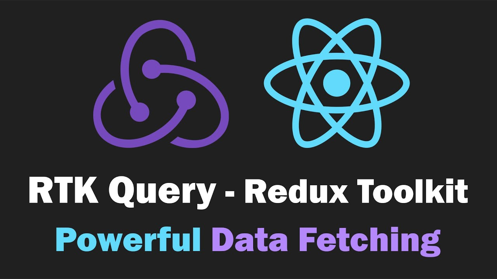

    
    <h1> Tanstack Table - React Sample</h1>

This repository was created with the intention of providing developers with a
sample of how to make a standardized implementation for a react app using
[TanStack Table](https://tanstack.com/table/v8)

# Development Tooling

# How to use it

1. Install pnpm globally in your machine. ([See the official docs](https://pnpm.io/installation))
2. Enter to each the directory `client` and `json-server` on different tabs in the terminal
3. Execute `pnpm install`
4. Execute `pnpm run dev` in `client` and `pnpm run server` in `json-server`
